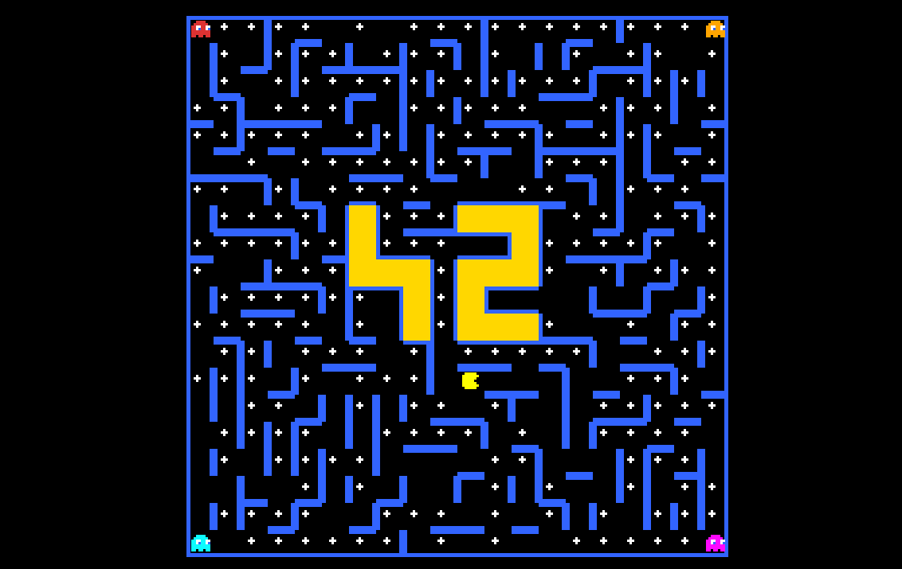
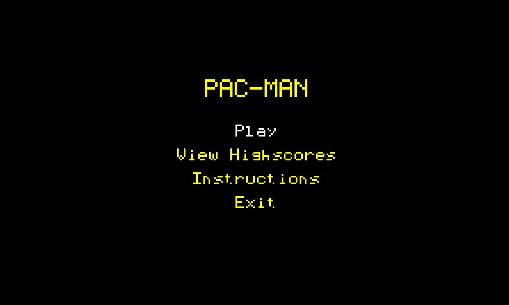

*This project has been created as part of the 42 curriculum by dbotelho, dbaltaza.*

# Pac-Man

Rebuilding the Pac-Man game in Python, on procedurally generated mazes.

### Game (so far)


### Menu (so far)


## Description

A Pac-Man clone written in Python 3.10+ with pygame-ce. Every level is a
freshly generated maze rather than the arcade original's fixed board: the
assigned `mazegenerator` package produces the layout, and the game places
the player, the four ghosts, the pacgums and the super-pacgums into it.

Eat every pacgum to clear a level. A super-pacgum frightens the ghosts for
a few seconds and makes them edible for points. Losing all your lives, or
running out of time on a level, ends the run — and a good enough score goes
into the highscore table.

## Instructions

```sh
make install        # virtualenv, requirements and the vendored maze package
make run            # equivalent to: python3 pac-man.py config.json
make run CONFIG=other.json
```

The program takes exactly one argument, the path to a configuration file.

<!-- TODO (dbotelho): the key table — movement, pause, quit, menu navigation,
     and the cheat keys (C to toggle, F1..F7 and what each one does).
     Required by the subject: cheat mode must be documented here and on the
     in-game Instructions screen. -->

## Resources

- [pygame-ce documentation](https://pyga.me/docs/)
- The assigned `mazegenerator` 2.1.0 package, used unmodified from `vendor/`.
- The 42 subject, `subject.md`.

<!-- TODO (both): how AI was used and for what. This section is explicitly
     required by the subject, and a vague answer is worse than none. Be
     concrete: which tool, on which modules, for what kind of task, and what
     was written by hand. -->

## Configuration

The configuration file is JSON, with one addition: any line whose first
non-blank character is `#` or `//` is stripped before parsing, so the file
can be commented.

The parser never stops the program over a bad *value*:

| Situation | What happens |
|---|---|
| Key missing | The default is used, silently |
| Value invalid or out of range | `WARNING` on stderr, clamped to the nearest bound or replaced by the default |
| Key unknown | `INFO` on stderr, the key is ignored |
| File unreadable or malformed JSON | `ConfigError`, the program stops |

Keys, with the defaults from `config.json`:

| Key | Default | Meaning |
|---|---|---|
| `highscore_filename` | `highscores.json` | Where the highscore table is stored |
| `lives` | 3 | Lives per run |
| `points_per_pacgum` | 10 | Score for one pacgum |
| `points_per_super_pacgum` | 50 | Score for one super-pacgum |
| `points_per_ghost` | 200 | Score for eating a frightened ghost |
| `seed` | 42 | Maze seed; must be >= 1 |
| `level_max_time` | 90 | Seconds allowed per level |
| `frightened_time` | 8.0 | Seconds a super-pacgum keeps ghosts edible |
| `ghost_respawn_time` | 5.0 | Seconds before an eaten ghost returns |
| `ready_time` | 1.5 | The READY freeze before a level starts |
| `player_speed` | 5.0 | Tiles per second |
| `ghost_speed` | 4.0 | Tiles per second |
| `pacgum_density` | 90 | Percentage of corridor tiles that get a pacgum |
| `cheats_enabled` | true | Whether the cheat keys respond |
| `window_width` | 780 | Window width in pixels |
| `window_height` | 720 | Window height in pixels |
| `fps` | 60 | Frame rate cap |
| `levels` | 10 entries | `{"width": w, "height": h}` per level, in cells |

## Highscore

Scores are kept in the JSON file named by `highscore_filename`, as the top
ten entries only. A name is at most 10 characters and may contain letters,
digits and spaces; a score is a non-negative integer. Anything else in the
file is rejected rather than trusted.

Saving is done by writing a temporary file and renaming it over the target,
so an interrupted write cannot leave a half-written table behind.

## Maze Generation

Every level's layout comes from the assigned `mazegenerator` package, used
as-is and always with `perfect=False` — that setting removes dead ends, so
corridors loop and a chased player is never cornered. `pacman/core/maze_loader.py`
is the only module in the project that imports it.

The package returns one integer per maze **cell**, a bitmask of which of the
four sides have a wall (N=1, E=2, S=4, W=8). A set bit means the wall is
present, so an opening is `not (cell & bit)`.

That is not something the player can collide with, so the loader expands the
`w x h` cell grid into a `(2w+1) x (2h+1)` grid of tiles: cell `(cx, cy)`
lands at tile `(2cx+1, 2cy+1)`, and the even coordinates between them become
either a carved passage or solid wall. The expansion starts from a fully
solid grid and carves, never the other way round — a tile missed while
carving stays a wall, which is survivable, whereas a tile missed while
walling would be a hole in the border.

Two rules hold regardless of what the bitmasks say: the outer border is
always solid, and nothing is ever carved toward one of the package's fully
closed "42" glyph cells.

## Implementation

- Python 3.10+ and pygame-ce.
- Only pygame calls with an MLX equivalent are used. No `pygame.draw`, no
  `pygame.font`, no `transform`, no `mixer`: all drawing goes through a
  pixel buffer, and text is rasterised from a 5x7 block font.
- Every function carries type hints and a PEP 257 docstring. `make lint`
  runs flake8 (79 columns) and mypy; `make lint-strict` runs `mypy --strict`.
- `make test` runs the pytest suite. `pacman.core` is tested headlessly,
  with no window and no pygame import.
- `make package` builds a standalone binary with PyInstaller into `dist/`.

## General Software Architecture

The package `pacman/` is split into two sub-packages with a hard boundary:
**`pacman.core` never imports pygame or `pacman.ui`**, while `pacman.ui`
imports `core`. That is what keeps the rules testable without a display.

```
pac-man.py            argv check; maps every PacManError to a message and
                      an exit code (2 usage, 1 error, 130 interrupt)

pacman/core/          no pygame
  errors.py           PacManError and its subclasses
  log.py              the shared stderr logger
  config.py           JSON + comments, defaults, clamping
  maze_loader.py      the only importer of mazegenerator; cells -> tiles
  level.py            pellets, spawns, reachability, cached BFS distances
  entities.py         player and ghosts
  ghost_ai.py         per-ghost targeting
  game.py             one Level, one Player, four Ghosts; update(dt)

pacman/ui/            imports core
  highscores.py       the top-ten table, saved atomically
  blockfont.py        5x7 glyphs
  renderer.py         reads game state, writes pixels
  scenes.py           menu, play, pause, game over, instructions
  app.py              window, delta-time loop, current scene
```

A traceback reaching the user is a failing grade, so every error the user
can cause is a `PacManError` subclass, caught in `pac-man.py` and printed as
a readable line on stderr.

## Project Management

<!-- TODO (dbotelho): the split of work between the two of us, the branch
     and review workflow, and how the day-1 contract in WORK_SPLIT.md was
     agreed. WORK_SPLIT.md has the detail; this section should summarise it
     for a reader who has not opened that file. -->
