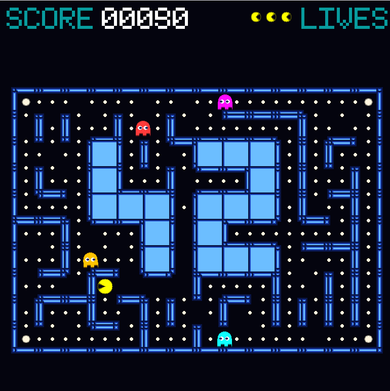
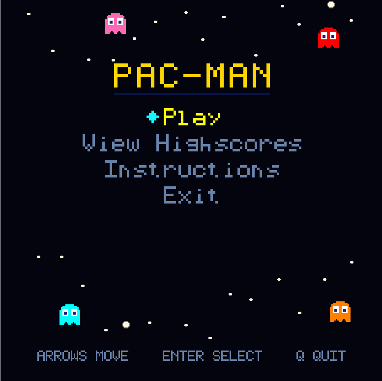
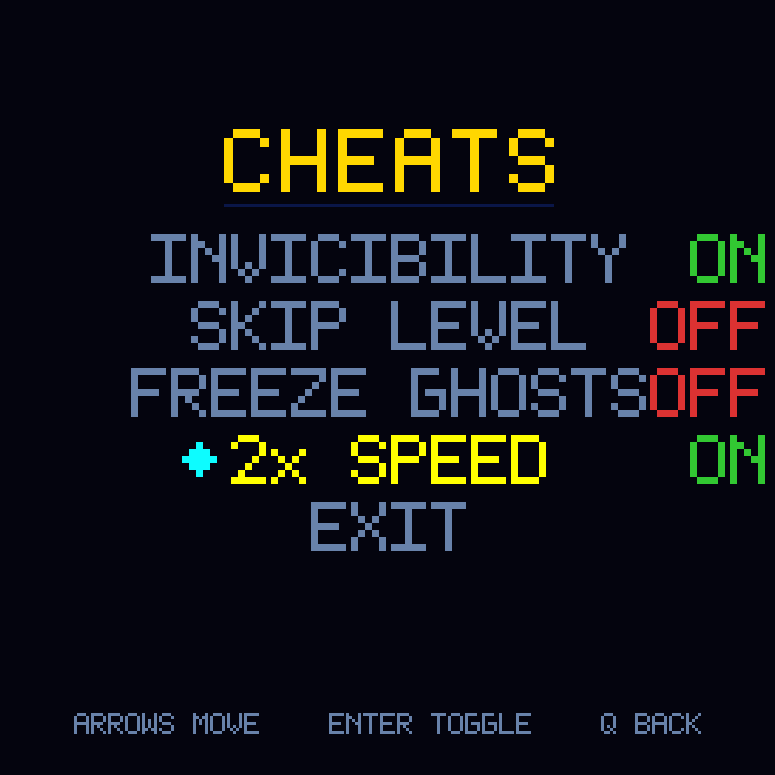

*This project has been created as part of the 42 curriculum by [dbotelho](https://github.com/sylvzzz) and [dbaltaza](https://github.com/dbaltaza)*

# Pac-Man

## Description

A Pac-Man clone in Python 3.10+ and pygame-ce. The goal of the project is to
build the full game loop (maze, player, four ghosts with different behaviours,
scoring, lives, levels, highscores) on top of the assigned `mazegenerator`
package, keeping the game rules independent from the graphics code.

Unlike the arcade original, every level is a freshly generated maze. The game
places the player, the ghosts, the pacgums and the super-pacgums inside it.

- Eat every pacgum to clear the level.
- A super-pacgum frightens the ghosts for a few seconds and makes them edible.
- You lose the run when you run out of lives or when the level timer hits zero.
  Good scores go into a highscore table.

| Game | Menu | Cheats |
| --- | --- | --- |
|  |  |  |

## Instructions

```sh
make install                 # virtualenv, requirements, maze package
make run                     # same as: python3 pac-man.py config.json
```

The program takes exactly one argument: the path to the configuration file.

Other targets:

| Command | What it does |
| --- | --- |
| `make lint` | flake8 (79 columns) + mypy |
| `make clean` | remove cache files |
| `make debug` | run the program trough python debugger |
| `make package` | standalone binary via PyInstaller, output in `dist/` |

### Controls

| Key | Where | Action |
| --- | --- | --- |
| Arrows | menus | move selection (left goes back) |
| Enter | menus | choose |
| Arrows | game | steer; a turn pressed early is kept until the next junction, the opposite key reverses at once |
| Esc | game | pause menu |
| R | game | restart the run from level 1 |
| Q | menus, game | quit (a run in progress is saved first) |
| Space / Enter | end screen | back to the menu |

### Cheat mode

Requires `cheats_enabled` in the config. Press `C` in game to open the cheat
menu, then press Enter on a row to arm it (its label turns `ON`). The first
armed cheat turns cheat mode on for the run. Close the menu with `C` or `Esc`.
Each cheat then works from its own key while its row is `ON`.

| Key | Effect |
| --- | --- |
| L | one extra life |
| I | invincible, ghosts can't hurt you |
| S | player moves 2x faster |
| F | freeze the ghosts |
| G | frighten every ghost, like a super-pacgum |
| N | skip to the next level |
| T | add 30 seconds to the level timer |

Disarming the `SCARE GHOSTS` row does not end an ongoing scare.

### Pace of the game

Ghosts leave their corners two seconds apart. For the first minute they
alternate between *scatter* (each heads for its own corner) and *chase* (each
hunts the player in its own way); after that they chase for good. A
super-pacgum turns every ghost around and makes it edible. Ghosts get 4%
faster per level, capped at +40% over the configured speed.

## Scoring

| Action | Config key | Points |
| --- | --- | --- |
| Eat a pacgum | `points_per_pacgum` | 10 |
| Eat a super-pacgum | `points_per_super_pacgum` | 50 |
| Eat a frightened ghost | `points_per_ghost` | 200 |

The score never decreases during a run.

## Configuration

The config file is JSON, with one extension: lines starting with `#` or `//`
(ignoring leading whitespace) are stripped before parsing, so you can comment
it.

The parser only stops the program on an unreadable file or invalid JSON. Bad
values never crash the game:

| Situation | Result |
| --- | --- |
| Key missing | default used, silently |
| Value invalid or out of range | `WARNING` clamped or replaced by the default |
| Unknown key | ignored |
| File unreadable / malformed JSON | `ConfigError`, program exits |

Keys and defaults (as in `config.json`):

| Key | Default | Meaning |
| --- | --- | --- |
| `highscore_filename` | `highscores.json` | where the highscore table is stored |
| `lives` | 3 | lives per run |
| `points_per_pacgum` | 10 | score per pacgum |
| `points_per_super_pacgum` | 50 | score per super-pacgum |
| `points_per_ghost` | 200 | score for eating a frightened ghost |
| `seed` | 42 | maze seed, must be >= 1 |
| `level_max_time` | 90 | seconds allowed per level |
| `frightened_time` | 8.0 | seconds a super-pacgum keeps ghosts edible |
| `ghost_respawn_time` | 5.0 | seconds before an eaten ghost returns |
| `ready_time` | 1.5 | READY freeze before a level starts |
| `player_speed` | 5.0 | tiles per second |
| `ghost_speed` | 4.0 | tiles per second |
| `pacgum_density` | 90 | % of corridor tiles that get a pacgum |
| `cheats_enabled` | true | whether cheat keys respond |
| `window_width` | 780 | window width in pixels |
| `window_height` | 720 | window height in pixels |
| `fps` | 60 | frame rate cap |
| `levels` | 10 entries | `{"width": w, "height": h}` per level, in cells |

## Highscore

The table lives in the JSON file named by `highscore_filename` and keeps only
the top ten entries.

- **One row per name.** A returning player only replaces their row if the new
  score is higher, so one person can't fill the whole table.
- **Validated on load.** Names are at most 10 characters (letters, digits,
  spaces) and scores are non-negative integers. Anything else in the file is
  rejected instead of trusted, so a hand-edited or corrupted file can't break
  the game.
- **Atomic saves.** We write a temporary file and rename it over the target,
  so a crash or Ctrl+C mid-write never leaves a half-written table.


## Maze Generation

Levels come from the assigned `mazegenerator` package, used as-is and always
with `perfect=False`. That setting removes dead ends, so corridors form loops
and a chased player is never cornered. `pacman/core/maze_loader.py` is the
only module that imports the package.

The package returns one integer per **cell**: a bitmask of which sides have a
wall (N=1, E=2, S=4, W=8; a set bit means a wall, so an opening is
`not (cell & bit)`). The game needs tiles it can collide with, so the loader
expands the `w x h` cell grid into a `(2w+1) x (2h+1)` tile grid. Cell
`(cx, cy)` becomes tile `(2cx+1, 2cy+1)`, and the even coordinates between
cells are either a carved passage or a wall.

The expansion starts from solid walls and carves, never the reverse: a tile
missed while carving stays a wall (harmless), while one missed while walling
would be a hole in the border. Two rules hold whatever the bitmasks say: the
outer border is always solid, and nothing is carved toward the package's fully
closed "42" glyph cells.

## Implementation

- Python 3.10+, pygame-ce.
- Only pygame calls that have an MLX equivalent are used: no `pygame.draw`,
  `pygame.font`, `transform` or `mixer`. Text and sprites are drawn by hand
  (5x7 block font, hand-rasterised Pac-Man and ghosts).
- Ghost behaviour is per-ghost targeting on top of cached BFS distances
  computed once per level.
- Rendering is cached so each frame does as little work as possible
  (`pacman/ui/renderer.py`):
  - The maze walls are drawn once per level onto a window-sized surface; each
    frame only blits it. This is the biggest gain.
  - The maze origin is cached by `(maze, cell_size)`.
  - Pellet shapes are "stamps": the scanline half-widths of the circle are
    memoised per radius, so a circle is worked out once per radius rather than
    once per pellet per frame.
  - The menu decoration (ghost and pellet positions) is randomised once per
    process, otherwise the panel would flicker on every key press.
  - The 16 wall shapes (`WALL_MASKS`) and the font glyphs are built once at
    startup.
- Every function has type hints and a PEP 257 docstring; code passes flake8
  and mypy.
- Every error a user can trigger is a `PacManError` subclass, caught in
  `pac-man.py` and printed as a readable line on stderr, so no traceback
  reaches the user. Exit codes: 2 usage, 1 error, 130 interrupt.

## General Software Architecture

Two sub-packages with a hard boundary: **`pacman.core` never imports pygame or
`pacman.ui`**; `pacman.ui` imports `core`. This is what lets the game rules be
tested without a display.

```
pac-man.py            argv check, maps PacManError to message + exit code

pacman/core/          no pygame
  errors.py           PacManError and subclasses
  log.py              shared stderr logger
  config.py           JSON + comments, defaults, clamping
  maze_loader.py      only importer of mazegenerator; cells -> tiles
  level.py            pellets, spawns, reachability, cached BFS distances
  entities.py         player and ghosts
  ghost_ai.py         per-ghost targeting
  game.py             one Level, one Player, four Ghosts; update(dt)

pacman/ui/            imports core
  highscores.py       top-ten table, atomic save
  blockfont.py        5x7 glyphs
  figures.py          hand-rasterised sprites
  maze.py             wall shapes for the 16 cell codes
  renderer.py         Screen: reads game state, draws pixels
  scenes.py           menu, name entry, play (pause, cheats), end, pages
  app.py              window, main loop, key names
```

`Game` owns the state and advances it with `update(dt)`; `Screen` only reads
that state and draws it; scenes decide what to show and which input goes where.

## Project Management

We split the work along the architecture:

- **dbaltaza:** `pacman.core`, the game backend and the config parser.
- **dbotelho:** `pacman.ui`, rendering, scenes and input.

The boundary between the two (core never imports pygame) doubles as the
contract between us. We agreed on the interface on day one, before writing any
code, and wrote it down in [project_management](project_management/organization.md).

Each of us worked on separate branches and merged through pull requests. A
CI/CD pipeline runs on every push and PR (lint, type checks, tests) together
with an automated AI review, which caught edge cases we had missed and
suggested improvements. We still read and decided on every suggestion
ourselves.

Details: [project_management](project_management/organization.md)

## Resources

- [pygame-ce documentation](https://pyga.me/docs/)
- `mazegenerator` 2.1.0, the assigned package
- Claude

### How AI was used

Most of the code was written by hand. AI was used in a few specific places:

- **UI performance.** The game was lagging. Claude helped
  find work that was being redone every frame and move it into caches, all in
  `pacman/ui/renderer.py` (listed under Implementation).
- **Visual polish.** Small improvements to how the game looks.
- **Docstrings, tests and documentation.** Writing and polishing the
  PEP 257 docstrings, helping with the pytest suite, and rewriting this README.
- **Debugging and documentation on the core (dbaltaza).** Help
  tracking down bugs in `pacman.core` and the config parser, and writing the
  documentation for them.
- **Automated push and PR review (both of us).** Our CI/CD pipeline runs a
  free model from [build.nvidia.com](https://build.nvidia.com) on every push
  and PR, covering both `pacman.core` and `pacman.ui`. It flagged edge cases
  and suggested improvements, which we then accepted or rejected by hand.

All AI output was read, tested and adjusted by us before being kept.